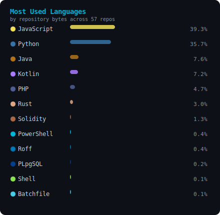

# Abhijeet Sahoo

### AI/ML Engineer · Builder · Recent Graduate

---

## About Me

- Recent graduate with a focused interest in building production-ready AI/ML systems — from local LLMs and RAG pipelines to fine-tuned models
- I build end-to-end: from CAD design and 3D printing to embedded software and model deployment
- Projects span AI/ML, Android, Web, Blockchain, QA automation, and hardware — 17 public repositories and counting
- Open to AI/ML engineering roles, research collaborations, and freelance opportunities

---

## Tech Stack

---

## GitHub Stats

---

## AI/ML Projects

<table>
<tr>
<td valign="top">

### [Greninja — Personal Assistant](https://github.com/Greninja110/Greninja)

_Description coming soon_

`Languages:` —

</td>
<td valign="top">

### [Object Detection and Recognition](https://github.com/Greninja110/mini-project)

_Description coming soon_

`Languages:` —

</td>
</tr>
<tr>
<td valign="top">

### [Local RAG — Local LLM, No API Key](https://github.com/Greninja110/local-RAG)

_Description coming soon_

`Languages:` —

</td>
<td valign="top">

### [AI Powered Sales Analysis Dashboard](https://github.com/Greninja110/sales_force_analysis)

_Description coming soon_

`Languages:` —

</td>
</tr>
<tr>
<td valign="top">

### [Kaggle Playground Competitions](https://github.com/Greninja110/kaggle-playground)

_Description coming soon_

`Languages:` —

</td>
<td valign="top">

### [AI Chatbot](https://github.com/Greninja110/chatbot)

_Description coming soon_

`Languages:` —

</td>
</tr>
<tr>
<td valign="top">

### [LLM Fine Tuning](https://github.com/Greninja110/fine-tuning)

_Description coming soon_

`Languages:` —

</td>
<td valign="top">&nbsp;</td>
</tr>
</table>

---

## Other Projects

### Android

<table>
<tr>
<td valign="top">

### [EduLocker](https://github.com/Greninja110/EduLocker-App)

_Description coming soon_

`Languages:` —

</td>
<td valign="top">

### [ARCam](https://github.com/Greninja110/arcam)

_Description coming soon_

`Languages:` —

</td>
</tr>
</table>

### Blockchain

<table>
<tr>
<td valign="top">

### [BlockChainCV](https://github.com/Greninja110/BlockChainCV)

_Description coming soon_

`Languages:` —

</td>
<td valign="top">&nbsp;</td>
</tr>
</table>

### QA Automation

<table>
<tr>
<td valign="top">

### [QA Checklist](https://github.com/Greninja110/QA-Checklist)

_Description coming soon_

`Languages:` —

</td>
<td valign="top">

### [Automatic SEO](https://github.com/Greninja110/Automatic-SEO)

_Description coming soon_

`Languages:` —

</td>
</tr>
</table>

### Web

<table>
<tr>
<td valign="top">

### [College Management System](https://github.com/Greninja110/aaaaaaattend)

_Description coming soon_

`Languages:` —

</td>
<td valign="top">

### [Portfolio Website](https://github.com/Greninja110/real_website)

_Description coming soon_

`Languages:` —

</td>
</tr>
</table>

### Hardware + Software

<table>
<tr>
<td valign="top">

### [CAR — End-to-End Hardware and Software Build](https://github.com/Greninja110/CAR)

_Description coming soon_

`Languages:` —

</td>
<td valign="top">&nbsp;</td>
</tr>
</table>

### Desktop

<table>
<tr>
<td valign="top">

### [Media Player](https://github.com/Greninja110/media_player)

_Description coming soon_

`Languages:` —

</td>
<td valign="top">&nbsp;</td>
</tr>
</table>

### Freelance

<table>
<tr>
<td valign="top">

### FlatPartner `Private`

_Description coming soon_

`Languages:` —

</td>
<td valign="top">&nbsp;</td>
</tr>
</table>

---

## Connect

